# Deploy Button ESP8266

## ABOUT

This project was created to be an generic and agnostic environment deploy button, it can deploy to multiple servers(16 limit) in different build conditions, that also may handle different languages in the same device.

The trick here is to delegate all the complexity of the environments to an API running on your local machine, so the device itself only need to build a request based upon your choises and the API will handle it by matching a ENV that has the command to deploy in the environment that you have chose when the button was triggered. And how probably you already have those dependencies and accesses in your machine it wont be concern at all.

The API code can be found in: [deploy_button_api](https://github.com/the-harry/deploy_button_api).

## INSPIRATION

This project was inspired in few others deploys buttons that already exists, but I'd like to express my very special thanks to my teacher Thiago Chierici Cunha, that introduced me into this topic.
Few deploy buttons that have been used as inspiration are:

* [AWS IOT Button](https://aws.amazon.com/pt/iotbutton/)

* [DIY ARDUINO MICRO DEPLOY BUTTON](https://medium.com/@gregorkas/tutorial-a-simple-arduino-deploy-button-dbf6f7289427)

* [DIY ARDUINO UNO DEPLOY BUTTON - JS BASED](https://github.com/niallo/arduino-deploybutton)

* [This amazing deploy button box](https://www.chau.cc/the-deploy-button)

* [Also this one with similar lock mechanism](https://jamesonmccowan.com/2015/05/04/a-deploy-button/)

* [This Raspi deploy button](https://www.youtube.com/watch?v=m6V1PNkpMgg)

* [And this one](https://www.youtube.com/watch?v=T9xG2MaeNV4&t=156s)

* [Other raspi deploy button](https://www.losant.com/blog/build-a-two-man-launch-switch-with-a-raspberry-pi-3-and-losant)

* [And this verry cool briefcase deploy button](https://www.952studios.com/office-fun/launchbox-a-raspberrypi-powered-deployment-button/)

And many others...

Using a raspberrypi is cool, but expensive, using and arduino as a keyboard is also cool, but I need a device with HID support, and not all boards suports it, furthermore, it would be more dificult to deal with warnings, since they are shown upon the request response code, so the cheapest way to achieve this is using an esp8266 sending a post request to the API that makes the deploy itself.
Other problem is that most of this deploy buttons only deploy to a single environment, some due the language that it was built, or due to mechanical incapability, or even comercial reasons. That said, the main ideia of this project is to create a free open source deploy button that can deploy to any environment, using any language, in any plataform!

## How it works

When the device is triggered, it sends a post request to the API in your LAN with the payload: `{environment: NIBBLE}`, a [nibble](https://en.wikipedia.org/wiki/Nibble) is 4 bits long value, and it can be naturally mapped to an hex char, so if you send 0000, it will be converted to `0`, if you send 1111 it will be converted to `f`, that said we can deploy to 16 different environments.

This is used to map each nibble to one environment, this is acomplished by using environment vars, in this format: `RECIPE_<NIBBLE>`, e.g. `RECIPE_f`, and this var value must match a recipe name under `/opt/deploy_button/recipes`. The recipe will contain all commands needed to deploy the application, its just a shell script. More about recipes down below.

So for example, if you have a recipe called `heroku_staging` under `/opt/deploy_button/recipes` and you want this to be the environment `0` you can set a env like so:

```bash
export RECIPE_0=heroku_staging
```

So when you hit the button with the dipswitch with the value `0000` this deploys will be triggered.

## SOFTWARE

All the device code is in `device.ino`, before uploading the code to the device, remember to change wifi `SSID` and `PASSWORD` so the device can make a post to the API when you hit the button.

Also change the `API_KEY` to something safe, I recomend using a password generator for that.

After uploading the code it will blink both leds while it is not connected to wifi, when a deploy is triggered if the API returns 201 for the request it will blink the green led, if some error happen and the API returns 500 the device will blink the red one.

## HARDWARE

To build this project you will need the following itens, some of then are optional:

* ESP8266

* Jumpers

* 1 Red Led

* 1 Green Led

* 2 220ohm resistors

* 1 DIP SWITCH 4 terminals

* 1 Pushbutton module (You could also use a Pushbutton with a 220ohm resistor)

* 1 Mechanical switch and keycap (I've used a cherry MX blue) - (Optional, you may use only the push button, though it wont be so coll)

* 1 box (You can use any box that are able to fit all components, wood or plastic would be my choise, I've used an old ABS plastic box out of a power unit of an old printer, after some cuts and tweeks it was good to go)

* Hotglue and some thermo-retractile tubes is also good to have but may be replaced.


If you want to add a safety lock mechanism like I did you will need the following parts: (But you can build without it as well, just be aware that any acidental hit in the button may trigger a deploy)

* 1 Tubular lock (I've used one F&K Technologies Notebook lock that I had laing arround but you can use other model)

* 1 key ring (It will be flattened and glued to the end of the lock, so when it is rotated the circuit is closed)

* 2 medium nails

* 1 piece of wood (4CM X 2CM)

* Ducktape or glue to hold the wood inside the box

## PINOUT

```
LED_GREEN D7
LED_RED D8

BUTTON D0

SWITCH_1 D1
SWITCH_2 D2
SWITCH_3 D5
SWITCH_4 D6
```

## ASSEMBLE

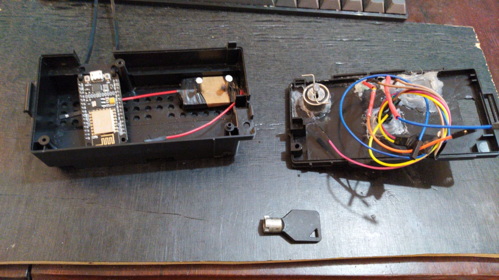

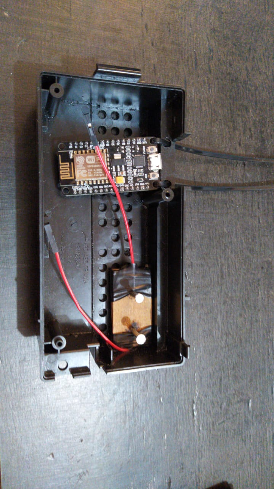

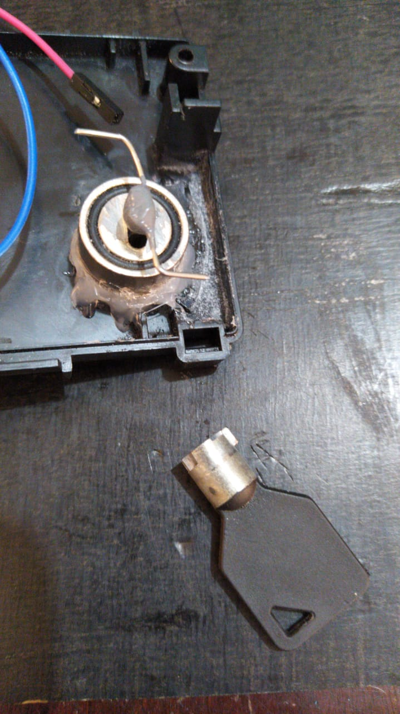

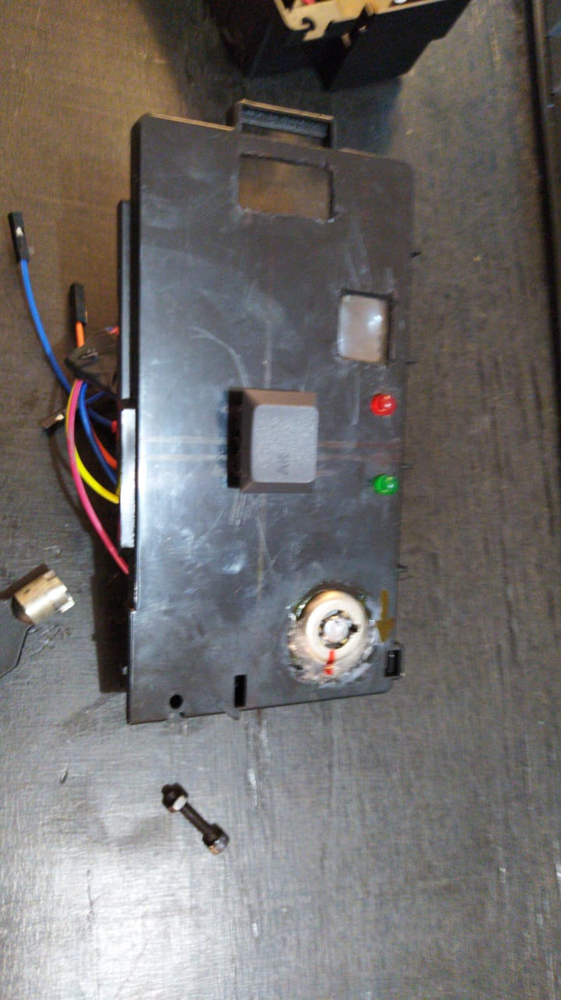

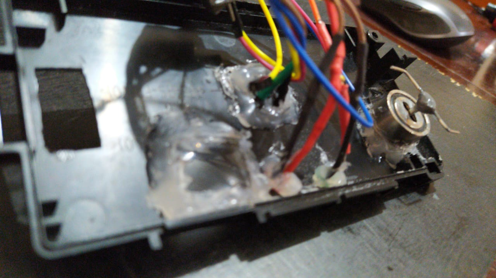

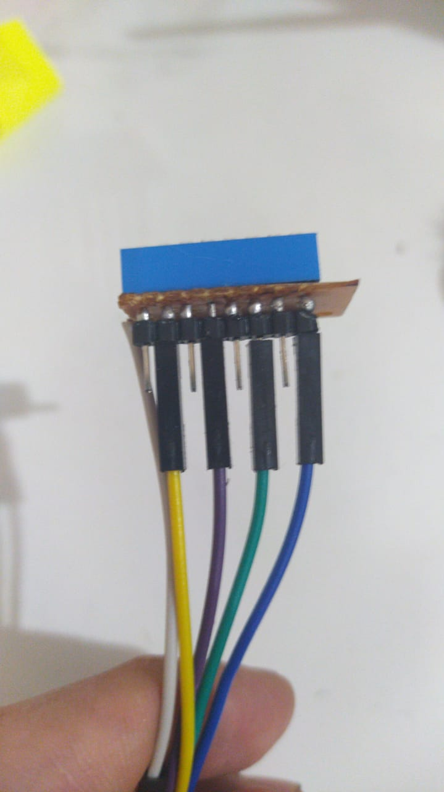

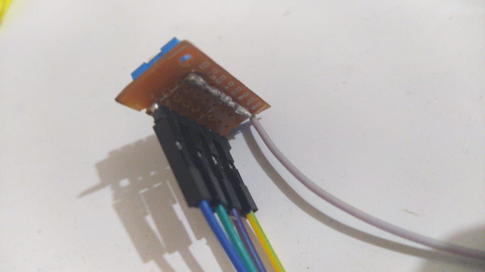

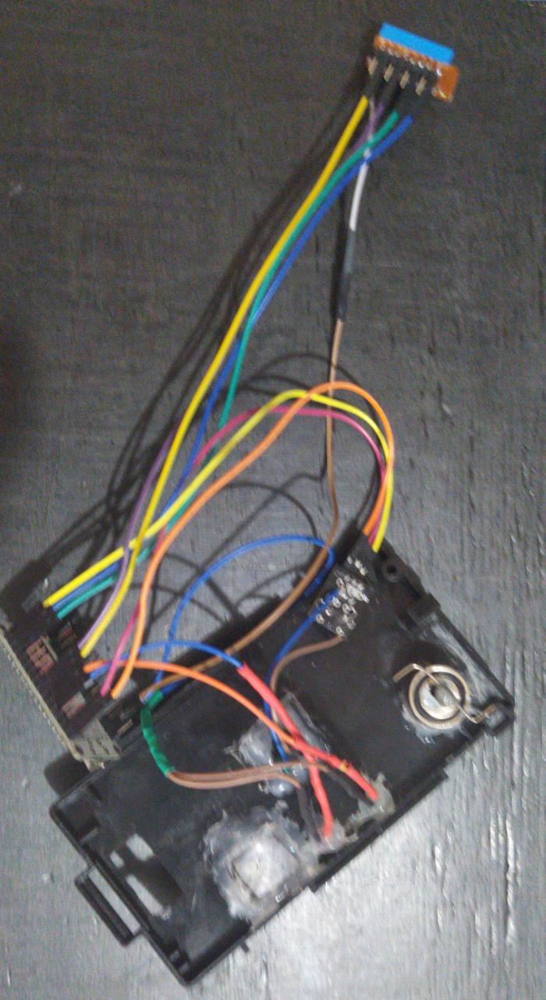

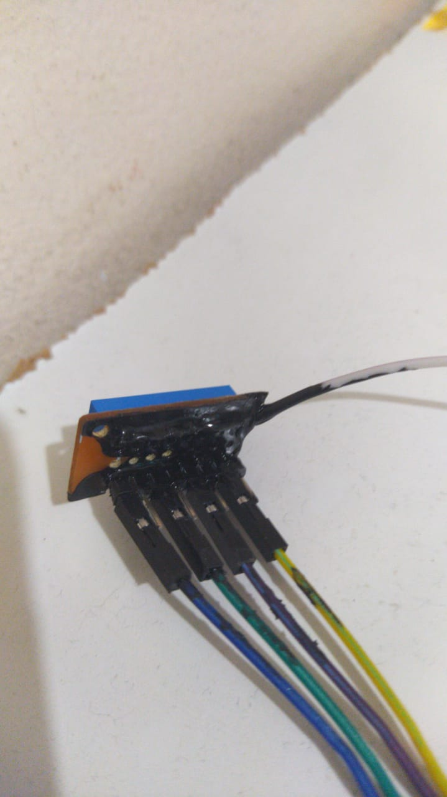

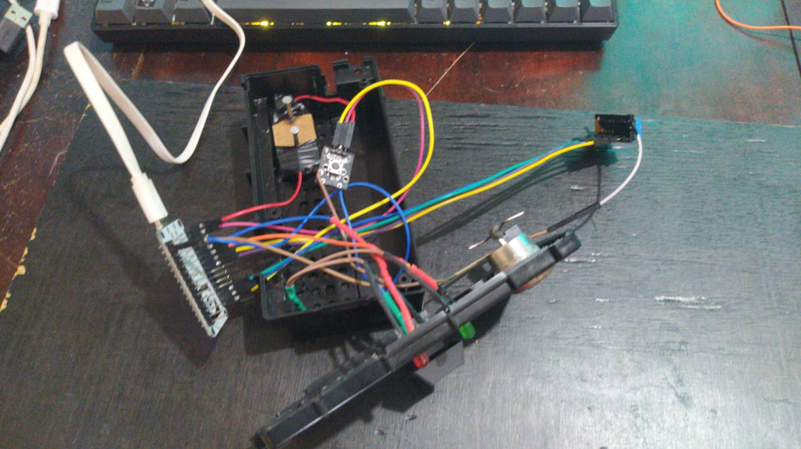

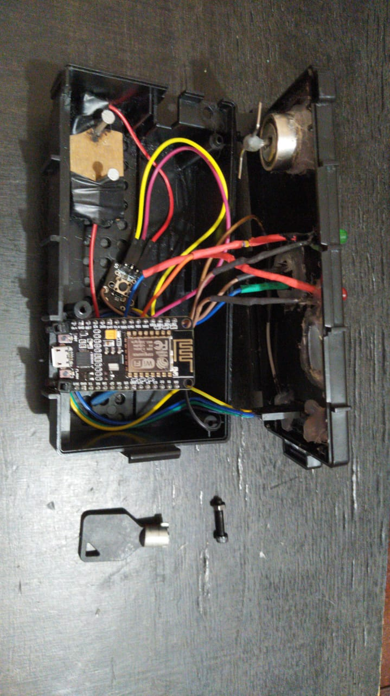

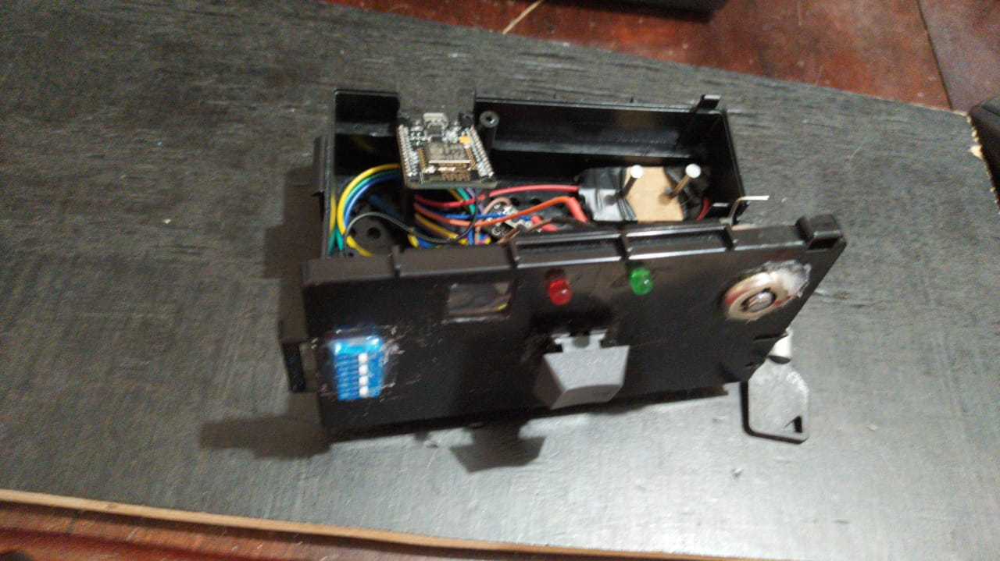

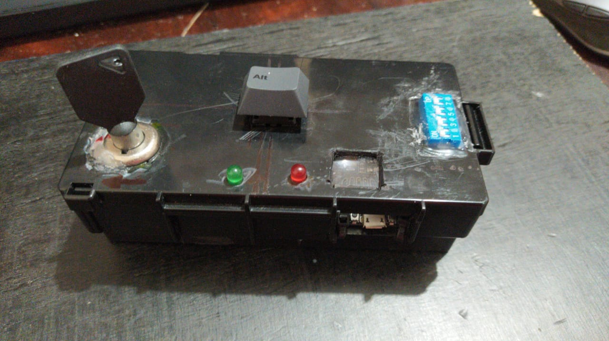

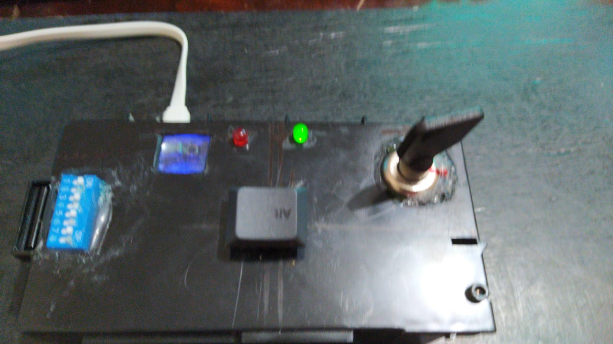
